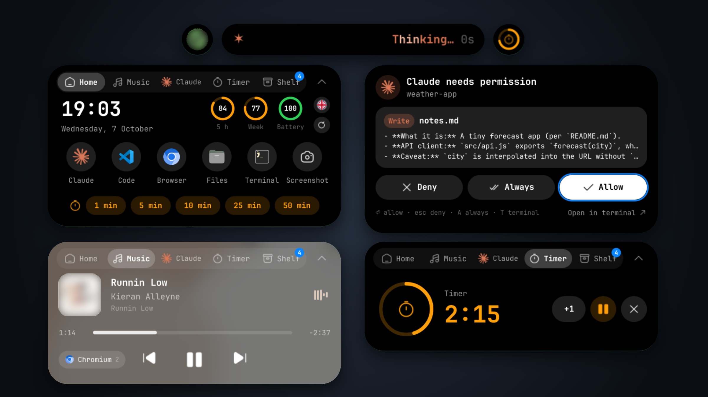
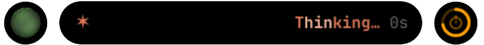
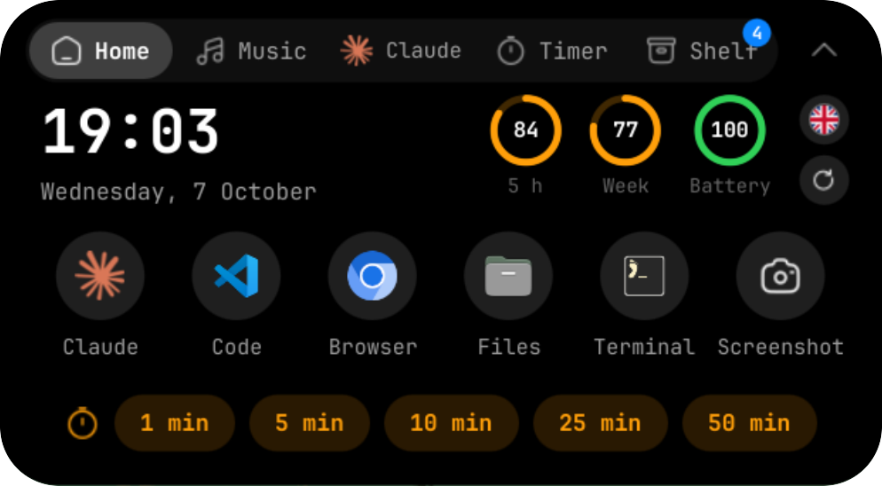
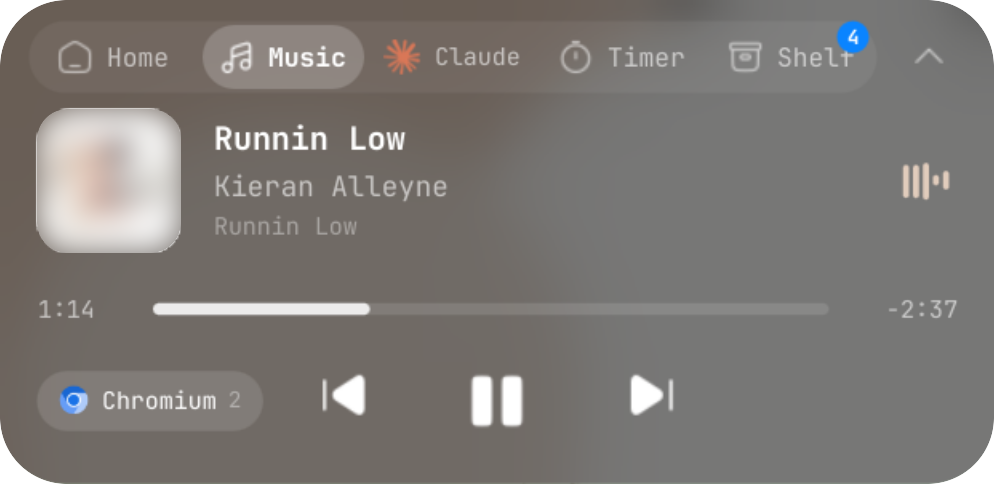
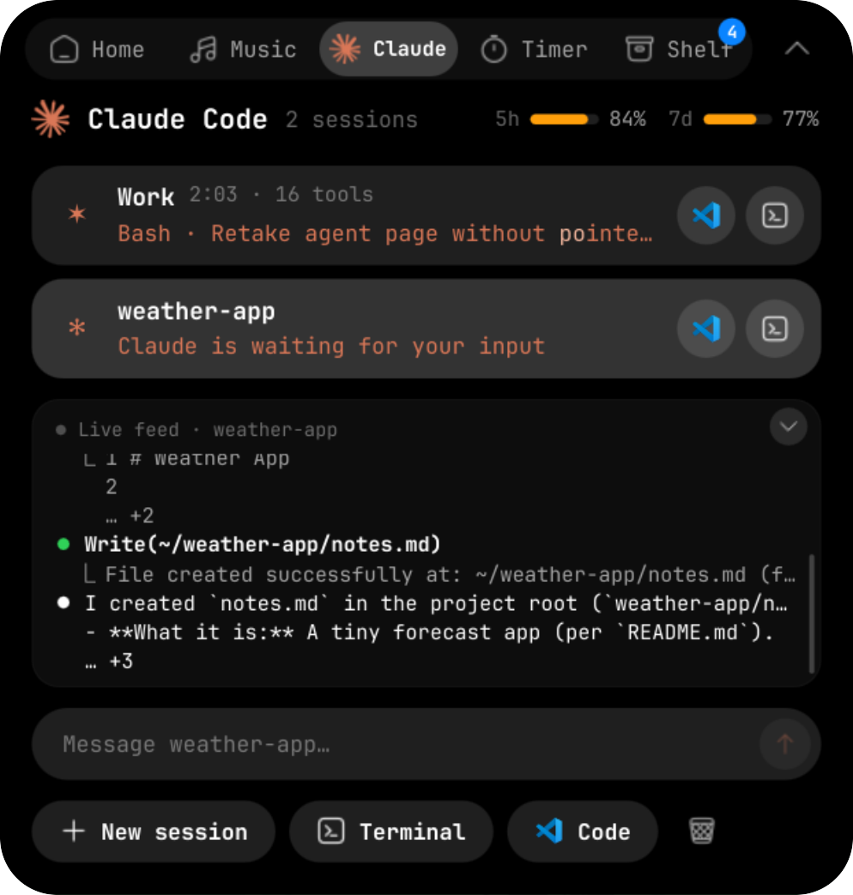
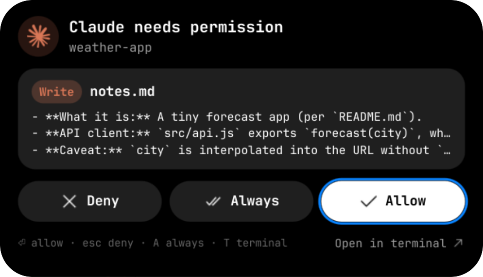
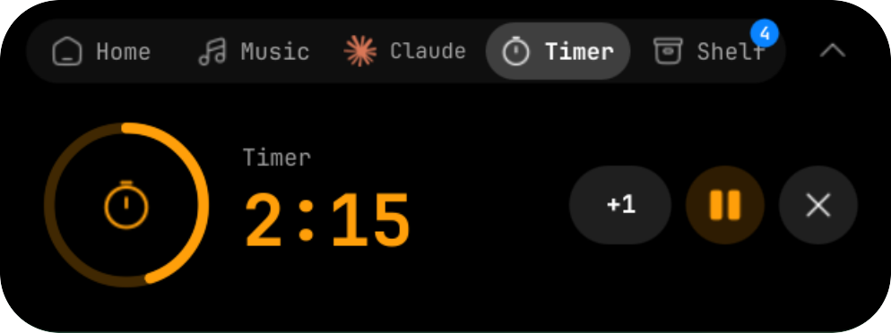
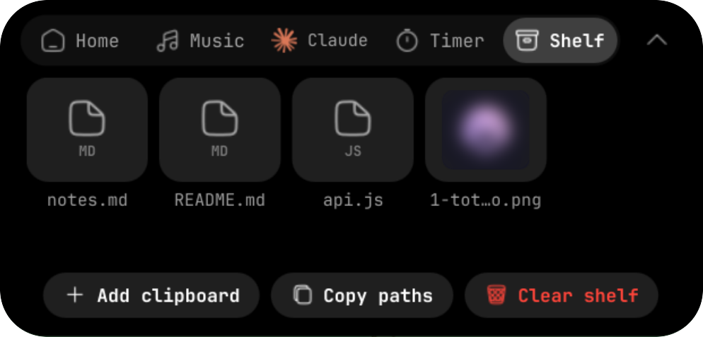

# Omarchy için Dynamic Island

[English](README.md)

[Omarchy](https://omarchy.org) bar'ının ortasında Apple tarzı bir Dynamic Island. Gerçeği gibi yay
fiziğiyle açılan, baloncuklara bölünen ve titreyen tek bir siyah şekil: müzik, sayaç, ekran kaydı,
dosya rafı, kısayollar ve **kodlama ajanı** oturumlarınız (Claude Code, Codex, Antigravity CLI,
OpenCode). Araç izinlerini doğrudan adadan onaylayabilir ya da reddedebilirsiniz.



## Ekran görüntüleri

**Kapalı hali**: ortada çalışan ajan, müzik ve sayaç yanlarda baloncuk olarak.

<p align="center"></p>

| Ana | Müzik |
|---|---|
|  |  |
| **Ajan**: oturumlar, canlı akış, mesaj kutusu | **İzin**: adadan izin ver / her zaman / reddet |
|  |  |
| **Sayaç** | **Raf** |
|  |  |

## Özellikler

| | |
|---|---|
| **Kompakt** | Boştayken saat; canlı etkinlik varsa solda ve sağda bilgi, ortası temiz |
| **Baloncuklar** | İkinci canlı etkinlik sağa, üçüncüsü sola ayrılır; her biri kendi başına çalışır. Çift tıklanan baloncuk ortayla yer değiştirir |
| **Peek** | Şarkı değişti, Claude bitirdi, şarj başladı… için kısa bant |
| **Genişletilmiş** | Ana · Müzik · Claude · Sayaç · Raf sekmeleri |
| **Uyarılar** | Claude izin isterse ya da süre dolarsa ada kendiliğinden açılır, cevaplanana kadar açık kalır |

- **Ana sayfa**: saat/tarih, Claude kullanım halkaları (5 saat / haftalık), pil; *varsayılan*
  ajan, editör, tarayıcı, dosya yöneticisi ve terminaliniz için kendi uygulama ikonlarıyla
  kısayollar; hızlı zamanlayıcılar.
- **Müzik**: tüm MPRIS oynatıcılar; kapak, sürüklenebilir ilerleme çubuğu, kontroller. Dalga formu kapak renginde.
  Müzik etkinliği yalnızca çalarken görünür; duraklatılınca ya da kapatılınca hemen kaybolur.
- **Yenile**: Ana sayfadaki yuvarlak ok tüm Omarchy kabuğunu yeniden başlatır (bar ve ada yeniden
  yüklenir); sağ tık yalnızca takılan adayı düzeltir (oturumlar, istekler, uyarılar).
- **Ajan**: Omarchy'nin varsayılan ajanını izler (`omarchy default agent …`): adı, logosu, renkleri ve
  spinner'ı. Tüm oturumlar, o an ne yaptıkları ve süreleri; terminale git, klasörü editörde aç, yeni oturum.
- **AI sekmesi**: o an çalışana göre adlanır: tek ajanın canlı oturumu varsa onun logosu ve adı,
  birkaç ajan varsa yalnızca logoları (iki tane, sonra "…"), hiçbiri yoksa "AI".
- **Ajan çubuğu**: birden fazla ajan çalışırken AI sayfasındaki logo küçük bir çubuğa dönüşür.
  Tıklayınca çalışan ajanlara açılır; birini seçince oturumlar, canlı akış, kullanım, "Bağla" ve
  "Yeni oturum" ona geçer. Sayfa en acil ajanla açılır (sizi bekleyen, sonra çalışan); ada
  kapanınca yine ona döner. Kapalı çubuktaki ya da bir ajan ikonundaki nokta, başka bir ajanın
  çalıştığını (kendi renginde) ya da sizi beklediğini (turuncu, yanıp sönen) gösterir.
- **İki ajan aynı anda**: iki farklı ajan çalışırken kapalı ada ortadan ikiye bölünür, her yarıda
  bir ajan (spinner, durum, logo). Her ajan çalıştığı sürece kendi tarafında kalır. Yarılar
  birbirinden bağımsızdır: imlecin üstündeki yarı kendi ajanının renginde yanar, üzerine gelmek
  ya da tıklamak o ajanın sayfasını açar. Biri boşa düşünce iki yarı yeniden tek adada birleşir.
- **Kullanım**: AI sayfası ve Ana sayfa, ekrandaki ajanın 5 saatlik ve haftalık limitlerini gösterir:
  Claude ve Codex Omarchy'nin ajan panelinden, Antigravity `agy -p /usage` ile (yerel, model
  çağrısı yok; agy'nin seçili modelinin kota grubu).
- **Canlı akış** (Claude Code, Codex, Antigravity CLI): oturumların altında son istekler, yanıtlar, araç çağrıları ve
  çıktıları, ajanın kendi terminalindeki gibi. Birden çok oturumda izlemek istediğinize tıklayın;
  akış kaydırılabilir (tekerlek ya da sürükleme); en alttayken yeni çıktıyı izler. Köşedeki ok
  akışı büyütür ve çıktıların tamamını kesmeden gösterir.
- **Mesaj kutusu**: akışın altına yazıp Enter'a basın, mesaj o oturuma gider. tmux içindeyse arka
  planda doğrudan gönderilir; değilse oturumun kendi terminal penceresi öne alınıp yazılır (`wtype`).
  Pencere tam olarak bulunamazsa hiçbir şey yazılmaz. İzin ya da soru açıkken kapalıdır.
- **İzinler**: araç, dosya/komut, renkli diff; **İzin ver / Her zaman / Reddet**. Ada, ajanın terminal
  sorusuyla yarışır: hangisinden cevap verirseniz diğeri kapanır.
- **Sayaç**: geri sayım (+1 dk, duraklat, tekrarla) ve kronometre; süre dolunca ses.
- **Ekran kaydı**: Omarchy kaydı kırmızı kayıt etkinliği olarak görünür; tıklayınca durur.
- **Birden çok oynatıcı**: birden fazla uygulamada medya varsa (iki tarayıcı, tarayıcı ve Spotify…)
  oynatma düğmelerinin yanındaki küçük çip gösterilen oynatıcıyı yazar. Tıklayınca liste açılır,
  izlemek istediğinizi seçersiniz; başka bir oynatıcı çalmaya başlayana kadar seçili kalır (o devralır). Sağ tık ya da tekerlek sıradakine
  geçer, "Otomatik" çalanı izler.
- **Ambiyans ışığı**: müzik çalarken kapak resminin renkleri oynatıcının arkasından yumuşakça
  süzülür, YouTube'un ambiyans modu gibi (sol ve sağ, en canlı iki rengi alır). Yalnızca oynatıcı
  parlar: müzik ortadaysa ada, değilse müzik yuvarlağı. Ada müzik sekmesinde açıkken renkler
  kartın kendisini doldurur ve yavaşça süzülür, Apple Music gibi. `cava` kuruluysa
  (`sudo pacman -S cava`) ışık sesle birlikte nefes alır; değilse sabit durur. Kapatmak için
  `"ambient": false` (yalnızca hareketi kapatmak için `"ambientAudio": false`).
- **Raf**: dosyaları adaya bırakın, sonra istediğiniz uygulamaya geri sürükleyin. Rafta bir şey
  varken yandaki raf yuvarlağı kaç öğe olduğunu ve ne kadar dolu olduğunu gösterir; yuvarlağa
  tıklamak kopyaladığınızı rafa ekler (Dosyalar'dan kopyalanan dosyalar ya da kopyalanan görsel/metin).
- Claude Code'un kendi spinner'ı (`· ✢ * ✶ ✻ ✽`) ve durum parlaması canlı bir `claude` oturumundan
  alındı; diğer ajanlar kendi CLI'larının braille spinner'ını kullanır.
- Kesirli ölçekte keskin: yazılar piksele hizalı, ikonlar ekranın gerçek piksel yoğunluğunda çizilir.

### Ajanlar

| Varsayılan ajan | Canlı oturum | Adadan izin |
|---|---|---|
| Claude Code | var | İzin ver · Her zaman · Reddet |
| Codex | var | İzin ver · Reddet |
| OpenCode | var | İzin ver · Her zaman · Reddet |
| Antigravity CLI | var | İzin ver · Her zaman (bu konuşmada) · Reddet; agy'nin kendi istem tuşlarıyla |
| Pi, Oh My Pi, Grok, Crush, Cursor, Copilot, Hermes, OpenClaw, Muse | — | — (olay API'si yok; marka, başlatma ve kullanım) |

Arka plan çalıştırmaları (`claude -p`, SDK betikleri) oturum ya da uyarı olarak görünmez.
- İngilizce, İspanyolca, Rusça ve Türkçe arayüz; Omarchy sistem fontunu kullanır.

Antigravity CLI (`agy`) her araç çağrısını hook'lara bildirir ama izin istemini bildirmez; bir
hook'un "izin ver" yanıtı da o istemi atlatmaz. Bu yüzden ada agy'nin kendi günlüğünü izler
(`Surfacing tool confirmation … at step N`, hook'un adım numarasıyla eşleşir) ve adadan yanıt
verdiğinizde agy'nin terminalinde istemin tuşuna basar: `1` çalıştır, `2` bu konuşmada hep izin
ver, `Esc` iptal. agy tmux'taysa arka planda, değilse Hyprland'in `send_shortcut`'ı ile doğrudan
agy'nin kendi penceresine (işlemle birebir eşleşen); odak hiç değişmez. Adadan izin vermek hiçbir
ajanda sizi terminale götürmez.
Terminalde yanıtlarsanız adadaki kart kendiliğinden kapanır.

### Etkileşim

| Hareket | Sonuç |
|---|---|
| Üzerine gel | Hafif büyür, imlece doğru eğilir; 380 ms sonra açılır |
| Tıkla | Açılır (basılıyken içe çöker) |
| Sağ tık | Ana sayfa |
| Müzikte orta tık | Oynat / duraklat |
| Kompakt adada tekerlek | Ses |
| Dosya sürükle | Raf açılır |
| İmleç ayrılır | 650 ms sonra kapanır (uyarı beklerken hariç) |
| Baloncuk: tık | O etkinliği aç |
| Baloncuk: çift tık (veya sağ tık) | Ortayla yer değiştir: adaya geçer, ortadaki onun yerine gider |
| Baloncuk: orta tık | Müziği oynat/duraklat, sayacı duraklat/sürdür |

Klavye (ada odaktayken): `Esc` kapat/reddet · `Enter`/`Y` izin ver · `A` her zaman · `N` reddet ·
`T` terminal · `[` `]` sekme · `Tab` düğmeler arası · `Boşluk` oynat/duraklat.

## Gereksinimler

- Omarchy 4 (Quickshell tabanlı `omarchy-shell`) ve Hyprland
- Omarchy'de zaten var: `python3`, `jq`, `wl-clipboard`, `wtype`, `tmux`, `pw-play`,
  `notify-send`, `xdg-open`, `nautilus`
- İsteğe bağlı:
  - [`cava`](https://github.com/karlstav/cava) (`sudo pacman -S cava`): ambiyans ışığı sesle hareket
    eder; yoksa ışık sabit durur
  - `sound-theme-freedesktop`: sayaç bitince çalan ses; yoksa sayaç sessiz biter (bildirim yine gelir)
  - yukarıdaki ajanlardan herhangi biri

Eklentiyi etkinleştirmek sisteminize hiçbir şey kurmaz ve hiçbir ayarı değiştirmez. Ajan bağlamak
ve bar'da yer açmak ayrı, açık adımlardır (aşağıda) ve ikisi de geri alınabilir.

## Kurulum

Ada, [Islands](https://github.com/DanielLob-o/Islands) bar (`lobo.islands`) ve ortası boş bir bar
ile tasarlandı. Başka bir bar'da ya da bar'ın ortası doluysa adanın Ana sayfasında **Kur** kartı
çıkar ve bu düzeni tek tıkla kurar (önceki düzen yedeklenir; `dynamic-island-bar-setup --undo`
geri alır). Siz basmadan hiçbir şey değişmez.

```sh
omarchy plugin add https://github.com/ofa14-prog/omarchy-dynamic-island.git
omarchy plugin enable io.github.ofa14-prog.dynamic-island
```

Bar'ın ortasında yer açın (ortadaki widget'ları sağa taşır, geri alınabilir):

```sh
~/.config/omarchy/plugins/io.github.ofa14-prog.dynamic-island/bin/dynamic-island-bar-setup
# geri al: …/bin/dynamic-island-bar-setup --undo
```

Ajanlarınızı bağlayın: adanın ajan sayfasındaki **Bağla** düğmesiyle (varsayılan ajan için) ya da:

```sh
~/.config/omarchy/plugins/io.github.ofa14-prog.dynamic-island/bin/dynamic-island-agent-setup claude codex
# seçenekler: claude codex antigravity opencode all · --remove … · --status
```

Claude Code `~/.claude/settings.json`, Codex `~/.codex/hooks.json`, Antigravity CLI
`~/.gemini/config/hooks.json` dosyasına hook ekler; OpenCode için `~/.config/opencode/plugins/` altına eklenti bağlantısı koyar.
Her dosya önce yedeklenir, yalnızca adanın kendi girdileri eklenir/kaldırılır. Ada çalışmıyorsa
hook'lar hiçbir şey yazmaz ve ajan normal davranır.

İsteğe bağlı kısayollar, `~/.config/hypr/bindings.lua` içine:

```lua
o.bind("SUPER + ALT + I", "Dynamic Island", "omarchy-shell -q dynamicisland toggle")
o.bind("SUPER + ALT + Y", "Claude: izin ver", "omarchy-shell -q dynamicisland approve")
o.bind("SUPER + ALT + N", "Claude: reddet", "omarchy-shell -q dynamicisland deny")
o.bind("SUPER + ALT + T", "Dynamic Island: sayaç", "omarchy-shell -q dynamicisland open timer")
```

## Ayarlar

İsteğe bağlı `~/.config/omarchy/dynamic-island.json`; değişiklikler anında uygulanır. Tüm anahtarlar
için [İngilizce README'deki tabloya](README.md#settings) bakın. Örnek:

```json
{ "language": "tr", "agent": "", "reduceMotion": false, "hoverDelay": 380 }
```

## Diller

İngilizce (varsayılan), İspanyolca, Rusça ve Türkçe. Ana sayfadaki bayrak düğmesinden seçilir
(`~/.config/omarchy/dynamic-island.json` dosyasına kaydedilir); tarihler de dile uyar. Ayarda
`"language": "auto"` sistem dilini kullanır.

## IPC

```sh
omarchy-shell dynamicisland toggle | open <home|music|agent|timer|shelf> | close
omarchy-shell dynamicisland reset | restartShell
omarchy-shell dynamicisland approve | always | deny
omarchy-shell dynamicisland timer 300 | stopwatch | timerStop
omarchy-shell dynamicisland shelfAdd /dosya/yolu
omarchy-shell dynamicisland notify "Başlık" "Alt satır"
omarchy-shell dynamicisland status | sessions | events
```

## Kaldırma

```sh
~/.config/omarchy/plugins/io.github.ofa14-prog.dynamic-island/bin/dynamic-island-agent-setup --remove all
~/.config/omarchy/plugins/io.github.ofa14-prog.dynamic-island/bin/dynamic-island-bar-setup --undo
omarchy plugin remove io.github.ofa14-prog.dynamic-island
```

## Teşekkür

Arayüz ikonları [Reicon](https://github.com/dqev/reicon)'dan (MIT; temel ikonlar Solar Icons,
CC BY 4.0). Ajan logoları (Claude, OpenAI, Gemini, OpenCode, Copilot, Cursor, X) Simple Icons,
Antigravity [LobeHub Icons](https://github.com/lobehub/lobe-icons) (MIT) üzerinden; sahiplerinin ticari markalarıdır ve bu proje hiçbiriyle bağlantılı değildir. Ayrıntılar: [icons/NOTICE.md](icons/NOTICE.md).

MIT Lisansı, bkz. [LICENSE](LICENSE).
